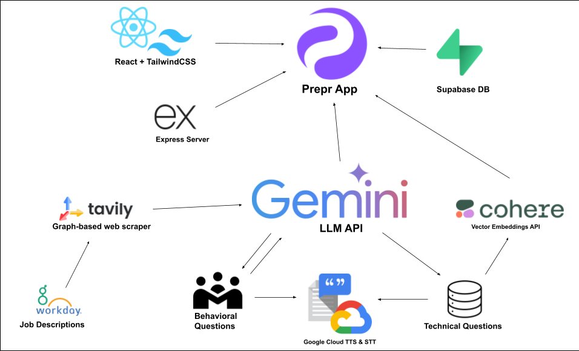

# Prepr - AI Interview Practice Platform

🏆 **Built for HackRice 15** - AI-powered interview preparation with real-time feedback and personalized questions.

<div align="center">
  
</div>

## 🎯 What is Prepr?

Prepr helps you practice interviews with AI. Upload your resume and job description, then get personalized behavioral and technical questions with instant feedback on your answers.

## ✨ Features

- **Smart Questions**: AI generates questions tailored to your background and target job
- **Voice Interaction**: Speak your answers naturally with speech-to-text
- **Real-time Feedback**: Get scored evaluations and improvement suggestions
- **Video Analysis**: AI analyzes your presentation skills and body language
- **Technical Practice**: Practice coding questions with semantic evaluation

## 🛠️ Tech Stack

- **Frontend**: React 19 + TypeScript + Vite + Tailwind CSS
- **Backend**: Node.js + Express + TypeScript + Supabase
- **AI**: Google Gemini + TTS/STT + Cohere Embeddings
- **Other**: PDF parsing, video analysis, real-time transcription

## ✨ Key Features

### **AI-Powered Interview Experience**
- **Personalized Questions**: Generates tailored behavioral and technical questions based on your resume and target job
- **Voice-Based Interaction**: Natural speech-to-text and text-to-speech for realistic interview feel
- **Real-Time Analysis**: Live transcription and video analysis during interviews
- **Smart Question Selection**: AI selects most relevant technical questions from a curated database

### **Comprehensive Feedback System**
- **Behavioral Analysis**: STAR method evaluation with strengths and improvement suggestions
- **Technical Evaluation**: Semantic similarity scoring and keyword matching for technical answers
- **Presentation Analysis**: Computer vision analysis of eye contact, posture, and engagement
- **Detailed Scoring**: Granular feedback with actionable improvement recommendations

### **Interview Preparation Tools**
- **Resume Upload**: PDF parsing and content extraction
- **Job Description Analysis**: AI-powered job requirement understanding
- **Company Research**: Integration with company information for targeted preparation
- **Practice Sessions**: Technical question practice with role-specific filtering

## 🛠️ Technologies Used

### **Frontend Stack**
- **React 19** with TypeScript for type-safe component development
- **Vite** for lightning-fast development and building
- **Tailwind CSS 4** for modern, responsive styling
- **Framer Motion** for smooth animations and transitions
- **React Router DOM** for seamless navigation
- **Lucide React** for consistent iconography

### **Backend Architecture**
- **Node.js** with Express.js for robust API development
- **TypeScript** for enhanced code reliability and developer experience
- **Supabase** for authentication and database management
- **PDF Processing** with pdfjs-dist for resume parsing
- **Multer** for efficient file upload handling

### **AI & ML Integration**
- **Google Gemini 1.5 Flash** for intelligent question generation and content analysis
- **Google Text-to-Speech API** for natural voice synthesis
- **Google Speech-to-Text API** for accurate transcription
- **Cohere Embeddings** for semantic similarity analysis and caching
- **Computer Vision** for presentation skills assessment

### **Development Tools**
- **ESLint** for code quality and consistency
- **TSX** for TypeScript execution in development
- **CORS** for secure cross-origin resource sharing
- **dotenv** for environment variable management

## Getting Started

### Prerequisites
- **Node.js** (v18 or higher)
- **npm** or **yarn**
- **API Keys** for Google Cloud, Cohere, Supabase, and Tavily

### Installation

1. **Clone the repository:**
   ```bash
   git clone https://github.com/chadd28/prepr-interview-platform.git
   cd prepr-interview-platform
   ```

2. **Install backend dependencies:**
   ```bash
   cd backend
   npm install
   ```

3. **Install frontend dependencies:**
   ```bash
   cd ../frontend
   npm install
   ```

### Environment Configuration

4. **Backend environment setup:**

   Create `backend/.env`:
   ```env
   PORT=3000
   
   # Google Cloud APIs
   GOOGLE_TTS_API_KEY=your_google_tts_api_key
   GOOGLE_STT_API_KEY=your_google_stt_api_key
   GEMINI_API_KEY=your_gemini_api_key
   
   # Supabase Configuration
   SUPABASE_URL=your_supabase_project_url
   SUPABASE_KEY=your_supabase_anon_key
   SUPABASE_SERVICE_ROLE_KEY=your_supabase_service_role_key
   
   # AI Services
   COHERE_API_KEY=your_cohere_api_key
   TAVILY_API_KEY=your_tavily_api_key
   ```

5. **Frontend environment setup:**

   Create `frontend/.env`:
   ```env
   VITE_BACKEND_URL=http://localhost:3000
   VITE_GOOGLE_API_KEY=your_google_api_key
   ```

### API Setup Guide

#### Google Cloud APIs
1. Go to [Google Cloud Console](https://console.cloud.google.com/)
2. Create a new project or select existing one
3. Enable the following APIs:
   - **Text-to-Speech API**
   - **Speech-to-Text API**
   - **Generative AI API** (for Gemini)
4. Create API keys in "APIs & Services" > "Credentials"

#### Supabase Setup
1. Go to [Supabase](https://supabase.com/)
2. Create a new project
3. Get your project URL and API keys from Settings > API

#### Cohere API
1. Sign up at [Cohere](https://dashboard.cohere.ai/)
2. Generate an API key from the dashboard

#### Tavily API
1. Sign up at [Tavily](https://tavily.com/)
2. Get your API key for web search functionality

### Running the Application

6. **Start the backend server:**
   ```bash
   cd backend
   npm run dev
   ```

7. **Start the frontend development server:**
   ```bash
   cd frontend
   npm run dev
   ```

8. **Access the application:**
   - **Frontend**: http://localhost:5173
   - **Backend**: http://localhost:3000

## 🤝 Contributing

We welcome contributions to improve Prepr! Here's how to get started:

1. **Fork the repository**
2. **Create a feature branch**: `git checkout -b feature/amazing-feature`
3. **Make your changes** with proper testing
4. **Commit your changes**: `git commit -m 'Add amazing feature'`
5. **Push to the branch**: `git push origin feature/amazing-feature`
6. **Open a Pull Request**

### **Development Guidelines**
- Follow TypeScript best practices
- Maintain consistent code formatting with ESLint
- Add proper error handling and logging
- Include tests for new features
- Update documentation as needed

## 🏆 HackRice 15 Project

Prepr was developed for HackRice 15, showcasing the power of AI in education technology. The platform demonstrates innovative use of multiple AI services to create a comprehensive interview preparation experience.

### **Key Innovations**
- **Multi-modal AI analysis** combining text, audio, and video
- **Real-time feedback** during interview sessions
- **Personalized question generation** based on user context
- **Semantic understanding** for technical evaluation
- **Computer vision** for presentation skills assessment

## 📄 License

This project is licensed under the MIT License - see the [LICENSE](LICENSE) file for details.

## 🙏 Acknowledgments

- **HackRice 15** for providing the platform to showcase this innovation
- **Google Cloud** for providing powerful AI APIs
- **Cohere** for advanced embedding capabilities
- **Supabase** for seamless backend infrastructure
- The open-source community for excellent tools and libraries

---

**Ready to ace your next interview?** Get started with Prepr today! 🚀